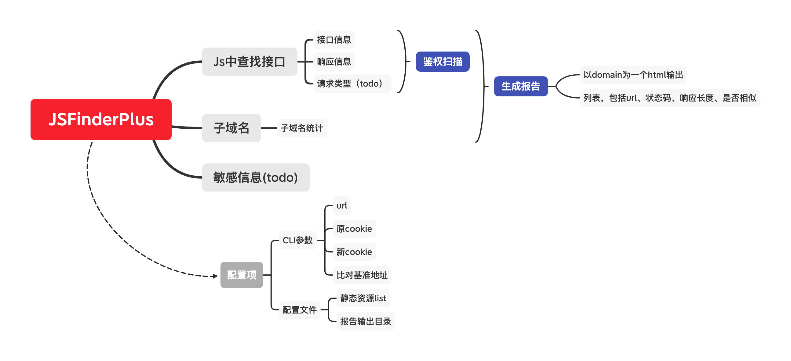

# JSFindersPlus
Implementing some extended functions based on JSFinder.

## How to use

```bash
# 默认使用
python3 main.py -u target_url

# 指定相似对比的基准url
python3 main.py -u target_url -p base_url

# 指定cookie，包括新请求cookie和基准请求cookie
python3 main.py -u target_url -nc "new cookie"
python3 main.py -u target_url -oc "original cookie"
python3 main.py -u target_url -nc "new cookie" -oc "original cookie"
```

## How it works


